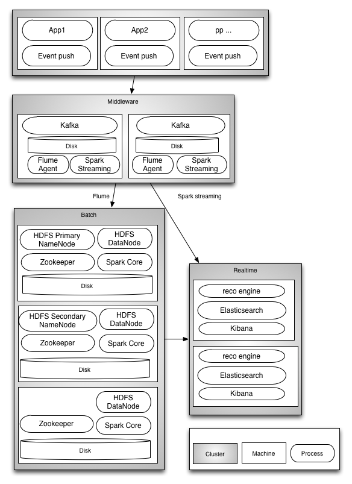

# HDFS / Spark / Mesos / Flume / Kafka / Elasticsearch / Kibana / Zeppelin BigDataLab with Ansible

## The Datalab structure
This Ansible project allows you to deploy instantly a datalab with the following three areas :

- A Middleware area : Handle incoming events. All incoming events are stored in Kafka before being pushed by Flume to HDFS and /or Flume/Spark Streaming to the realtime nodes.
- A Batch area : Deal with batch processing. Work area for the Datascientits who may use Zeppelin and run queries using Spark Core
- A realtime area : Deal with realtime insight rendering with Elasticsearch and Kibana

## Cluster Design
The Datalab is managed by Mesos. All services are configured in a way that make them highly available with no sngle point of failure.

The following services are installed as native services :
- Zookeeper : Three or more zookeeper nodes
- Mesos master : Three or more master mesos nodes
- Mesos slaves : One slave per physical node
- Marathon : 3 marathon services to manage long running services
- Haddop Cluster : Hadoop services are running on the batch area only and are configured as follow for high availability :
  - One primary and one secondary name node
  - 2 Zookeeper failover controller
  - 3 journal nodes
  - One Data node per physical batch node
- Apache Spark is installed and run on top of Mesos in one of the two modes : Coarsed grained of fined grained. Coarse grained when using Zeppelin (Adhoc queries) and fine grained when running periodic batch jobs through Chronos

The following roles are run on top of mesos and launched through Marathon :
- Apache Kafka : One instance per physical node in the middleware area
- Apache Flume : As many agents as required, make sure you use a reliable channel (Aka Kafka) so that you don't loose messages
- Apache Zeppelin : Used as a Spark notebook and installed on a single batch. Marathon will take care to relaunch it if it required.
- Apache Spark is installed on middle and batch nodes for realtime and batch processing.
- Apache Chronos is run on one of the batch nodes and in charge of managing periodic batchs.
- Elasticsearch cluster is run on the realtime nodes with one instance per physical realtime node
- Kibana est also run on realtime node. A single instance is launched, Marathon will take care of realucnhing it if required.

## Cluster Sample

## Future Work
- Add Kerberos Security
- Monitoring with Ganglia
- Pushbutton custom app deployment with Jenkins / Artefact repository / Ansible
